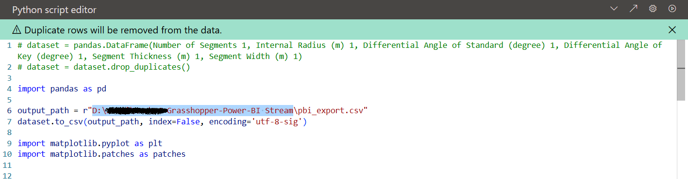

# TunCO2: Automating embodied carbon assessment and design optimisation for TBM tunnelling

## Embodied carbon assessment for TBM tunnelling in Power BI

The embodied carbon assessment follows EN 15978 for system boundary Module A1-A5. In "Tunnel Emission.pbix", please follow each tab from left to right to calculate your TBM tunnel's embodied carbon. The detailed methodology can be referred to the "Sustainability of Underground Infrastructure" Part 1 and Part 3. 

## Optimisation for low carbon tunnel support 

The interface provides an example of dealing with conflicting objectives between low carbon design and traditional tunnel analysis, where tunnel support safety may be compromised by introducing carbon reduction measures (e.g., thinner lining with less strength). The optimisation algorithm searches for a series of Pareto optimal solutions, where a objective cannot be further improved without compromising other objectives. 

The multi-objective optimisation is conducted for minimising embodied carbon (Module A1-A3) of tunnel lining while maximising the corresponding Factor of Safety (FoS). The embodied carbon of tunnel support is assessed considering concrete strength grade (The corresponding embodied carbon factor of concrete is estimated by linear fitted line, see "Sustainability of Underground Infrastructure" Part 1). The geometric parameters of tunnel diameter, lining thickness, and other geotechnical properties can be input accordingly as shown in the interface. The tunnel support safety is assessed using the Convergence-confinement Methods, please refer to  "Sustainability of Underground Infrastructure" Part 2 for detailed methodology and justification. The failure model for estimating the Ground Reaction Curve and Longitudinal Displacement Profiles can be costomised to fit user's project.  

### Interface setup

Open folder "Tunnel Emission and Optimisation 1.0.0", please ensure that Python has been added to your system's environment variables (you can do this by running the Python installer). 

Before using the program, run setup_environment_and_dependencies.bat. 

Once completed, run Start.bat to begin.

## Grasshopper-Power-BI-Stream

This project's functionality is aimed at generating real-time models in Power BI using the UI within Power BI. The method involves first generating data files through Power BI, then using Grasshopper to read these data files, uploading them to the Speckle website, and finally displaying them in Power BI. The plugins used in this project include Speckle and Pancake.

### Plugin Setup

First, install grasshopper and Power BI connector at https://speckle.systems/connectors . Installing speckle connectors for Power BI and Grasshopper.

Open Grasshopper, open Component Folder here, then drag Pancake.gha into the Component Folder shown in the figure.

Open Power BI, click the three dots in the Visualizations panel, select "Import a visual from a file", and choose Speckle Power BI 3D Visual.pbiviz. This file can be found at C:\Users\<Your User Name>\Documents\Power BI Desktop\Custom Visuals after installing Power BI connector.

### Path Setup

After installing the plugins, open the Tunnel_Lining.3dm file in Rhino, launch Grasshopper, and load the Tunnel_Generation.gh file, update the file path to the current location of your file.

 Open PBI UI.pbix in Power BI, click the blue-bordered area in the bottom-right corner, and update the path to the current file location.
 

 Then, register on the Speckle website (www.speckle.systems), create a new project.
 

 Create a model within this project and copy the model's URL.
 

 Enter the URL in the following two places: Open PBI UI.pbix, click on "Transform data", and paste your URL into the indicated field in figure below. 
 

Then click on "Data source settings" in "Transform data", click "Change source", then change the folder path of the file.
 

Next, click "file", "Options and settings", and Data source settings, click the speckle model website, click "Edit Permission", log in your own speckle account.

Open Tunnel_Lining.3dm, and open Tunnel_Generation.gh, paste the URL into the designated field.
 

With this, the setup is complete and you’re ready to start using the system.
 
## Steps for Use

First, open Tunnel_Lining.3dm and Tunnel_Generation.gh in the background, then launch PBI UI.pbix. Follow the steps shown below:

 **Hint:** The current version of the Speckle plugin has a bug where repeated refreshes may cause previous models to leave behind white translucent lines. The workaround is to uncheck the URL in this visual, and then check it again.
 

 Then, go to the second page. On this page, you can enter parameters related to tunnel details, view various tunnel properties, and finally check the estimated carbon emissions.
 

